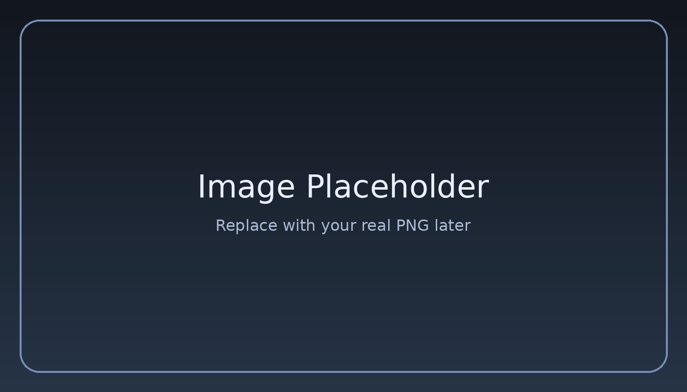
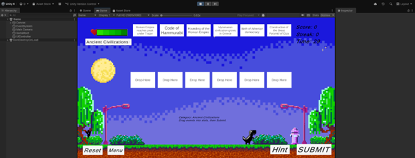

# SYAHMI PORTFOLIO v3 — TAILORED REDESIGN PROMPT
### Space Observatory Theme · Built on SyahmiPortfolio2.5-main · Full File-by-File Spec

---

> **CONTEXT FOR THE AI:**
> You have access to the existing SyahmiPortfolio2.5-main codebase. This prompt is a
> complete redesign directive. Preserve the multi-page structure and all real content.
> Redesign the visual language, 3D effects, and layout. Do NOT start from scratch —
> upgrade what exists. All file paths, image names, and video references below match
> the actual project structure.

---

## ═══════════════════════════════════════════
## PART 0 — EXISTING CODEBASE AUDIT
## ═══════════════════════════════════════════

### Current file structure (KEEP ALL, REDESIGN IN-PLACE):
```
index.html          → Home + hero + 3D z-scroll gallery + contact
projects.html       → 3-column grid of 6 project cards
biodata.html        → Personal data + about me + education timeline
skills.html         → Fancy skill cards with progress rings
projects/
  drag-and-drop-game.html     → Unity flashcard game detail
  opengl-cafeteria.html       → OpenGL 3D scene detail
  blender-workshop-2.html     → Blender rendering detail
  computer-animation.html     → Blender animation detail
  motion-graphics.html        → After Effects detail
  bujang-lapok.html           → Premiere Pro editing detail
apple.css           → Main stylesheet (rename to style.css or keep as-is)
style.css           → Shared stylesheet (currently used by sub-pages)
script.js           → Shared script (GSAP, Lenis, cursor, reveal)
apple-script.js     → Home-only script (THREE.js terrain + gallery z-scroll)
```

### Current tech stack (KEEP ALL, extend not replace):
```
Three.js r128       → Existing interactive terrain; TRANSFORM into starfield
GSAP 3.12.2         → Keep for all reveal/scroll animations
ScrollTrigger       → Keep for scroll-driven effects
Lenis 1.0.29        → Keep smooth scroll
Space Grotesk       → Currently loaded; ADD Orbitron + JetBrains Mono
```

### Real content extracted from codebase:
```
Full name:          Ahmad Syahmi Zufayri
Display name:       SYZ. (logo) / "Ahmad Syahmi Zufayri." (headings)
Email:              ahmadsyahmi723@gmail.com
GitHub:             https://github.com/Mie02
Role:               Vibe Coder · Developer · Designer · Creative Technologist
Location:           Malaysia (GMT+8)
Languages:          Malay, English
```

### Real education data (from biodata.html):
```
1. Sekolah Kiblah Sepang
   2015–2019 | SPM | Secretary PBSM + Badminton Club
   Logo: images/kiblah.png

2. Politeknik Sultan Mizan Zainal Abidin Terengganu (PSMZA)
   2020–2023 | Diploma in Computer Science (Digital Technology)
   CGPA: 3.40 | MUET: Band 4
   Logo: images/psmza.png

3. Universiti Teknikal Malaysia Melaka (UTeM)
   2024–Present | Bachelor of Computer Science (Interactive Media)
   FTMK | Year 3, Semester 1
   Logo: images/utem.png
```

### Real projects + images (from projects.html + /projects/ folder):
```
1. Drag & Drop Game       → images/dd1–4.png, videos/dd1.mp4  | Unity C#
2. OpenGL 3D Cafeteria    → images/cf1–5.png                  | C++ OpenGL
3. Motion Graphics        → images/mg1–6.png                  | After Effects
4. Computer Animation     → images/ca1–6.png                  | Blender Rigid Body
5. Blender Rendering      → images/ws1–7.png, videos/ws2p.mp4 | Blender
6. Bujang Lapok Recreate  → images/bj*.png                    | Premiere Pro
```

### Real skills (from skills.html with actual percentages):
```
Development & Code:
  C# / Unity        85%   (game logic, UI, physics)
  C++ / OpenGL      80%   (shaders, graphics pipelines)
  Web Technologies  75%   (frontend, GSAP, WebGL)
  Python & Java     70%   (scripting, OOP, algorithms)

Creative & Design:
  After Effects     90%   (motion graphics, kinetic typography)
  Blender 3D        85%   (modeling, texturing, lighting, render)
  Photoshop         80%   (UI assets, image manipulation)
  Premiere Pro      75%   (video editing, color grading)
```

---

## ═══════════════════════════════════════════
## PART 1 — DESIGN DIRECTION
## ═══════════════════════════════════════════

### THEME: DEEP SPACE OBSERVATORY
The current portfolio has an Apple/brutalist aesthetic (Space Grotesk, pure black,
thin white grid lines, wavy THREE.js terrain). 

**New direction:** Deep space mission control. The existing THREE.js terrain becomes
a star field. The wavy grid plane becomes a distant nebula pulse. Everything else
shifts from Apple-minimal to cinematic-dark-space. Same dark foundation — completely
different atmosphere.

### COLOUR PALETTE

```css
:root {
  /* REPLACE current CSS vars with these */
  --void:          #050810;   /* deep space black — replaces #000000 bg */
  --nebula:        #0C1A2E;   /* dark navy — card/section fills */
  --aurora:        #1B3A6B;   /* midtone blue — gradients */
  --plasma:        #00C6FF;   /* electric cyan — PRIMARY accent (replaces #2997ff) */
  --stellar:       #7B61FF;   /* violet-purple — secondary accent */
  --stardust:      #C8D8F0;   /* cool off-white — body text (replaces #f5f5f7) */
  --text-muted:    #7A8BA8;   /* muted blue-grey (replaces #86868b) */
  --supernova:     #FF6B6B;   /* warm red-orange — CTAs only */
  --glass-bg:      rgba(12, 26, 46, 0.6);    /* replaces rgba(28,28,30,0.6) */
  --glass-border:  rgba(0, 198, 255, 0.12);  /* plasma-tinted border */
  --glass-shadow:  0 8px 40px rgba(0, 198, 255, 0.08);
  
  /* KEEP these vars from current code: */
  --font-base: -apple-system, BlinkMacSystemFont, "Helvetica Neue", sans-serif;
  --font-display: "Orbitron", "Space Grotesk", var(--font-base); /* ADD Orbitron */
  --font-mono: "JetBrains Mono", monospace; /* ADD this new var */
}
```

### TYPOGRAPHY ADDITIONS
Add to `<head>` of ALL HTML files:
```html
<link href="https://fonts.googleapis.com/css2?family=Orbitron:wght@400;600;700;800&family=JetBrains+Mono:wght@400;500;700&family=Space+Grotesk:wght@300;400;500;600;700&display=swap" rel="stylesheet">
```

**Usage rules:**
- `Orbitron` → Logo "SYZ.", hero main title only, section eyebrow labels
- `Space Grotesk` → All headings h2/h3, section titles (keep current usage)
- `JetBrains Mono` → Nav links, tag pills, dates, metadata, badges, stat labels
- `--font-base` → All body paragraphs (unchanged)

### SIGNATURE ELEMENT
**The THREE.js terrain becomes a dual-layer star system.**
Keep the existing THREE.js setup. Replace the PlaneGeometry terrain with:
1. A `THREE.Points` particle field (3000+ stars, different sizes/opacities)
2. Keep the wavy grid plane BUT make it a distant, very subtle nebula haze
   (opacity 0.06, color #1B3A6B, no wireframe — replace with a ShaderMaterial
   that glows faintly as a nebula cloud)
3. Mouse-reactive: existing raycaster logic → apply subtle camera tilt instead
   of terrain deformation

---

## ═══════════════════════════════════════════
## PART 2 — FILE-BY-FILE REDESIGN SPEC
## ═══════════════════════════════════════════

---

### FILE 1 — apple.css (main stylesheet)

Replace the CSS custom properties as specified above.

**Body:**
```css
body.apple-theme {
  background-color: var(--void);
  color: var(--stardust);  /* was --text-color: #f5f5f7 */
  /* keep all other properties */
}
```

**Navbar — new space style:**
```css
.nav.scrolled {
  background: rgba(5, 8, 16, 0.85);  /* was rgba(0,0,0,0.7) */
  backdrop-filter: blur(16px);
  border-bottom: 1px solid var(--glass-border);  /* plasma-tinted */
}
.logo {
  font-family: "Orbitron", var(--font-display);
  font-size: 1.3rem;
  font-weight: 800;
  color: var(--plasma);  /* was var(--text-color) */
  letter-spacing: 0.05em;
}
.links a {
  font-family: var(--font-mono);
  font-size: 0.78rem;
  letter-spacing: 0.08em;
  color: var(--text-muted);
  text-transform: lowercase;  /* mission-control aesthetic */
}
.links a:hover, .links a.active {
  color: var(--plasma);
}
/* Add active indicator dot under nav link */
.links a.active::after {
  content: '';
  display: block;
  width: 4px;
  height: 4px;
  background: var(--plasma);
  border-radius: 50%;
  margin: 3px auto 0;
  box-shadow: 0 0 6px var(--plasma);
}
```

**Buttons — space edition:**
```css
.btn-primary {
  background: var(--plasma);
  color: var(--void);
  font-weight: 600;
  border-radius: 6px;  /* was 999px — change to sharp */
  letter-spacing: 0.05em;
  transition: background 0.25s, transform 0.2s, box-shadow 0.25s;
}
.btn-primary:hover {
  background: var(--stellar);
  box-shadow: 0 0 20px rgba(123,97,255,0.4);
  transform: scale(1.03);
}
.btn-secondary {
  background: transparent;
  color: var(--plasma);
  border: 1.5px solid var(--plasma);
  border-radius: 6px;
}
.btn-secondary:hover {
  background: var(--plasma);
  color: var(--void);
}
.btn-outline {
  border: 1px solid var(--glass-border);
  color: var(--stardust);
  border-radius: 6px;
}
```

**Stat cards — glass panel update:**
```css
.stat-card {
  background: var(--glass-bg);
  border: 1px solid var(--glass-border);
  border-radius: 16px;  /* was 24px */
  backdrop-filter: blur(20px);
  box-shadow: var(--glass-shadow);
  transition: transform 0.3s ease, box-shadow 0.3s ease, border-color 0.3s ease;
}
.stat-card:hover {
  border-color: rgba(0,198,255,0.3);
  box-shadow: 0 0 30px rgba(0,198,255,0.1);
  transform: translateY(-4px);
}
.stat-num {
  font-family: "Orbitron", var(--font-display);
  color: var(--plasma);  /* was --text-color */
}
.stat-label {
  font-family: var(--font-mono);
  font-size: 0.8rem;
  letter-spacing: 0.1em;
  text-transform: uppercase;
  color: var(--text-muted);
}
```

**Project cards:**
```css
.project-card {
  border-radius: 12px;  /* was 24px */
  border: 1px solid var(--glass-border);
}
.project-card:hover {
  transform: translateY(-8px);
  box-shadow: 0 20px 60px rgba(0,198,255,0.12),
              0 0 0 1px rgba(0,198,255,0.2);
  border-color: rgba(0,198,255,0.3);
}
.project-info h3 {
  font-family: "Space Grotesk", var(--font-base);
  color: var(--stardust);
}
.project-info p {
  font-family: var(--font-mono);
  font-size: 0.78rem;
  color: var(--plasma);  /* was --text-muted */
  letter-spacing: 0.06em;
}
```

**Custom cursor — plasma ring:**
```css
@media (pointer: fine) {
  #cursorDot {
    background-color: var(--plasma);  /* was --text-color */
    mix-blend-mode: normal;  /* was difference */
    box-shadow: 0 0 8px var(--plasma);
  }
  #cursorGlow {
    border: 1px solid rgba(0,198,255,0.4);  /* was rgba(255,255,255,0.2) */
  }
  .hover-active #cursorGlow {
    background: rgba(0,198,255,0.06);
  }
}
```

**Section title global:**
```css
.section-title {
  font-family: "Space Grotesk", var(--font-display);
  color: var(--stardust);
}
/* Add eyebrow label utility */
.eyebrow {
  font-family: var(--font-mono);
  font-size: 0.72rem;
  letter-spacing: 0.3em;
  text-transform: uppercase;
  color: var(--plasma);
  margin-bottom: 0.75rem;
  display: block;
}
```

---

### FILE 2 — apple-script.js (home page THREE.js — REPLACE terrain with star system)

**Keep:** Lenis setup, GSAP ScrollTrigger, cursor logic, reveal-up animations.

**Replace** the `initThreeJS()` function entirely:

```javascript
function initThreeJS() {
  const container = document.getElementById('webgl-container');
  if (!container) return;

  const scene = new THREE.Scene();
  scene.fog = new THREE.FogExp2(0x050810, 0.018);

  const camera = new THREE.PerspectiveCamera(70, window.innerWidth / window.innerHeight, 0.1, 2000);
  camera.position.set(0, 0, 80);

  const renderer = new THREE.WebGLRenderer({ alpha: true, antialias: true });
  renderer.setSize(window.innerWidth, window.innerHeight);
  renderer.setPixelRatio(Math.min(window.devicePixelRatio, 2));
  container.appendChild(renderer.domElement);

  // ── STAR LAYERS (3 depth layers) ──
  function createStarLayer(count, size, spread, zRange, opacity) {
    const geometry = new THREE.BufferGeometry();
    const positions = new Float32Array(count * 3);
    for (let i = 0; i < count; i++) {
      positions[i * 3]     = (Math.random() - 0.5) * spread;
      positions[i * 3 + 1] = (Math.random() - 0.5) * spread * 0.6;
      positions[i * 3 + 2] = (Math.random() - 0.5) * zRange;
    }
    geometry.setAttribute('position', new THREE.BufferAttribute(positions, 3));
    const material = new THREE.PointsMaterial({
      color: 0xC8D8F0,
      size: size,
      transparent: true,
      opacity: opacity,
      sizeAttenuation: true
    });
    return new THREE.Points(geometry, material);
  }

  const starLayerFar  = createStarLayer(1200, 0.15, 400, 300, 0.4);
  const starLayerMid  = createStarLayer(600,  0.3,  250, 200, 0.65);
  const starLayerNear = createStarLayer(120,  0.6,  150, 100, 0.9);
  // A few plasma-tinted accent stars
  const starAccent = createStarLayer(30, 0.8, 100, 80, 0.9);
  starAccent.material.color.set(0x00C6FF);

  scene.add(starLayerFar, starLayerMid, starLayerNear, starAccent);

  // ── NEBULA HAZE PLANE (replaces terrain) ──
  const nebulaGeo = new THREE.PlaneGeometry(300, 300, 1, 1);
  const nebulaMat = new THREE.MeshBasicMaterial({
    color: 0x1B3A6B,
    transparent: true,
    opacity: 0.04,
    side: THREE.DoubleSide
  });
  const nebulaPlane = new THREE.Mesh(nebulaGeo, nebulaMat);
  nebulaPlane.rotation.x = -Math.PI / 2;
  nebulaPlane.position.y = -40;
  scene.add(nebulaPlane);

  // ── MOUSE PARALLAX ──
  let mouseX = 0, mouseY = 0;
  document.addEventListener('mousemove', (e) => {
    mouseX = (e.clientX / window.innerWidth - 0.5) * 2;
    mouseY = (e.clientY / window.innerHeight - 0.5) * 2;
  });

  // ── ANIMATION LOOP ──
  const clock = new THREE.Clock();
  let animId;
  function animate() {
    animId = requestAnimationFrame(animate);
    const t = clock.getElapsedTime();

    // Subtle star drift
    starLayerFar.rotation.y  = t * 0.003;
    starLayerMid.rotation.y  = t * 0.005;
    starLayerNear.rotation.y = t * 0.008;
    starAccent.rotation.y    = t * 0.008;

    // Mouse parallax — each layer shifts differently
    starLayerFar.position.x  = mouseX * 1.5;
    starLayerFar.position.y  = -mouseY * 1.5;
    starLayerMid.position.x  = mouseX * 4;
    starLayerMid.position.y  = -mouseY * 4;
    starLayerNear.position.x = mouseX * 8;
    starLayerNear.position.y = -mouseY * 8;

    // Subtle nebula pulse
    nebulaMat.opacity = 0.03 + Math.sin(t * 0.4) * 0.015;

    renderer.render(scene, camera);
  }
  animate();

  // ── RESIZE ──
  window.addEventListener('resize', () => {
    camera.aspect = window.innerWidth / window.innerHeight;
    camera.updateProjectionMatrix();
    renderer.setSize(window.innerWidth, window.innerHeight);
  });
}

initThreeJS();
```

**Also update** the 3D Z-axis gallery scroll section in apple-script.js:
Find the existing `gsap.to('#galleryCamera', ...)` ScrollTrigger and add:
```javascript
// Plasma glow on gallery items on scroll reveal
gsap.utils.toArray('.gallery-item').forEach((item, i) => {
  gsap.fromTo(item, 
    { opacity: 0, filter: 'brightness(0.3)' },
    {
      opacity: 1,
      filter: 'brightness(1)',
      duration: 0.8,
      scrollTrigger: { trigger: item, start: 'top 80%' },
      delay: i * 0.15
    }
  );
});
```

---

### FILE 3 — index.html (HOME PAGE)

**Meta/title:** Keep `Ahmad Syahmi Zufayri — Developer Portfolio`

**Add to `<head>`:** Updated Google Fonts link (Orbitron + JetBrains Mono + Space Grotesk)

**Hero section** — replace the inner `.container` content:
```html
<section class="hero section-padding" style="min-height:100vh; display:flex; align-items:center; justify-content:center; position:relative;">
  <div class="container text-center" style="position:relative; z-index:10;">

    <!-- Eyebrow -->
    <div class="eyebrow reveal-up" style="margin-bottom:1.5rem;">
      TRANSMISSION INCOMING
    </div>

    <!-- Name — Orbitron + plasma glow -->
    <h1 class="hero-title reveal-up" style="
      font-family: 'Orbitron', var(--font-display);
      font-size: clamp(3.5rem, 10vw, 8rem);
      font-weight: 800;
      line-height: 0.9;
      letter-spacing: -0.02em;
      margin-bottom: 1.5rem;
      background: linear-gradient(180deg, var(--stardust) 0%, var(--plasma) 100%);
      -webkit-background-clip: text;
      -webkit-text-fill-color: transparent;
      text-shadow: none;
      filter: drop-shadow(0 0 40px rgba(0,198,255,0.35));
    ">
      Ahmad<br>
      <span style="font-weight:400; letter-spacing:0.05em;">Syahmi.</span>
    </h1>

    <!-- Tagline -->
    <p class="hero-subtitle reveal-up" style="
      font-family: var(--font-mono);
      font-size: 0.9rem;
      letter-spacing: 0.2em;
      text-transform: uppercase;
      color: var(--text-muted);
      border-left: none;
      padding-left: 0;
      text-align: center;
      margin-bottom: 3rem;
    ">
      Vibe Coder &nbsp;·&nbsp; Developer &nbsp;·&nbsp; Designer
    </p>

    <!-- CTAs -->
    <div class="hero-cta reveal-up" style="justify-content:center; gap:1.5rem;">
      <a href="projects.html" class="btn btn-primary">Explore Work</a>
      <a href="biodata.html" class="btn btn-secondary">About Me</a>
    </div>

    <!-- Scroll indicator -->
    <div class="reveal-up" style="margin-top:4rem;">
      <div style="
        font-family: var(--font-mono);
        font-size: 0.65rem;
        letter-spacing: 0.3em;
        color: var(--text-muted);
        text-transform: uppercase;
        animation: scrollPulse 2s ease-in-out infinite;
      ">scroll ↓</div>
    </div>

  </div>
</section>

<!-- Add to <style> or apple.css: -->
<style>
  @keyframes scrollPulse {
    0%, 100% { opacity: 0.3; transform: translateY(0); }
    50%       { opacity: 1;   transform: translateY(4px); }
  }
</style>
```

**Expertise / Stats section** — update stat cards:
```html
<!-- Replace stat-card content: -->
<!-- Card 1 -->
<div class="stat-num pop-out-extreme" style="font-family:'Orbitron',sans-serif; color:var(--plasma);">6+</div>
<div class="stat-label pop-out" style="font-family:var(--font-mono);">PROJECTS</div>
<p class="stat-desc push-in" style="color:var(--text-muted);">Interactive apps & games.</p>

<!-- Card 2 -->
<div class="stat-num pop-out-extreme" style="font-family:'Orbitron',sans-serif; color:var(--stellar);">3D</div>
<div class="stat-label pop-out" style="font-family:var(--font-mono);">GRAPHICS</div>
<p class="stat-desc push-in">OpenGL & Blender models.</p>

<!-- Card 3 -->
<div class="stat-num pop-out-extreme" style="font-family:'Orbitron',sans-serif; color:var(--supernova);">AE</div>
<div class="stat-label pop-out" style="font-family:var(--font-mono);">MOTION</div>
<p class="stat-desc push-in">After Effects typography.</p>
```

**3D Gallery section** — add plasma border-top to `gallery-item` cards:
```html
<!-- On each gallery-item .project-info div, add: -->
style="... border-top: 2px solid var(--plasma); ..."

<!-- On the "View All" card: -->
style="... background: var(--glass-bg); border: 1px solid var(--glass-border); border-top: 2px solid var(--stellar);"
```

**Gallery section title** — update:
```html
<h2 class="section-title reveal-up" style="
  font-family: 'Space Grotesk'; 
  background: var(--void); 
  display: inline-block; 
  padding: 10px 30px; 
  border: 1px solid var(--glass-border);
  color: var(--stardust);
">
  Selected Works.
</h2>
```

**Contact section** — update:
```html
<section id="contact" class="contact section-padding">
  <div class="container text-center">
    <span class="eyebrow reveal-up">OPEN CHANNEL</span>
    <h2 class="section-title reveal-up" style="font-size:clamp(2.5rem,5vw,4rem);">Let's Connect.</h2>
    <p class="reveal-up" style="color:var(--text-muted); margin-bottom:2.5rem; font-family:var(--font-mono); font-size:0.85rem; letter-spacing:0.1em;">
      OPEN TO INTERNSHIPS · COLLABORATIONS · NEW OPPORTUNITIES
    </p>
    <div class="contact-links reveal-up">
      <a href="mailto:ahmadsyahmi723@gmail.com" class="btn btn-primary">✉ Email Me</a>
      <a href="https://github.com/Mie02" target="_blank" class="btn btn-secondary">⌥ GitHub</a>
      <a href="assests/pdf/Syahmi_LogBook.pdf" target="_blank" class="btn btn-outline">↓ Logbook</a>
    </div>
  </div>
</section>
```

**Footer** — update:
```html
<footer class="footer">
  <div class="container text-center">
    <p style="font-family:var(--font-mono); font-size:0.75rem; color:var(--text-muted); opacity:0.5;">
      © <span id="year"></span> Ahmad Syahmi Zufayri · Built in the void between stars
    </p>
  </div>
</footer>
```

---

### FILE 4 — biodata.html

**Hero section:**
```html
<div class="eyebrow reveal-up">PROFILE: SYZ_001</div>
<h1 class="hero-title reveal-up" style="
  font-family: 'Orbitron', var(--font-display);
  font-size: clamp(2.5rem, 6vw, 5.5rem);
  background: linear-gradient(180deg, var(--stardust) 0%, var(--plasma) 100%);
  -webkit-background-clip: text;
  -webkit-text-fill-color: transparent;
  filter: drop-shadow(0 0 30px rgba(0,198,255,0.25));
">Ahmad Syahmi<br>Zufayri.</h1>
<p class="reveal-up" style="font-family:var(--font-mono); font-size:0.85rem; letter-spacing:0.2em; color:var(--text-muted); text-transform:uppercase;">
  Vibe Coder &nbsp;·&nbsp; Developer &nbsp;·&nbsp; Designer
</p>
```

**Personal Data grid cards** — add `eyebrow` class to `stat-label`, use mono font:
```html
<!-- Each stat-card: -->
<div class="stat-card reveal-up">
  <div class="stat-label" style="font-family:var(--font-mono); font-size:0.7rem; letter-spacing:0.2em; text-transform:uppercase; color:var(--plasma); margin-bottom:0.75rem;">LOCATION</div>
  <p class="stat-desc" style="font-size:1.1rem; color:var(--stardust); font-family:'Space Grotesk';">Malaysia (GMT+8)</p>
</div>
<!-- Status value should be var(--plasma) not var(--accent): -->
<p style="color:var(--plasma);">Active Student</p>
<!-- Email value: -->
<p style="font-size:0.95rem; color:var(--stardust);"><a href="mailto:ahmadsyahmi723@gmail.com" style="color:inherit; text-decoration:none;">ahmadsyahmi723@gmail.com</a></p>
```

**About Me section** — update the profile picture container:
```html
<!-- Replace current square container with hexagonal clip: -->
<div style="
  width: 300px; height: 300px;
  clip-path: polygon(25% 0%, 75% 0%, 100% 50%, 75% 100%, 25% 100%, 0% 50%);
  background: var(--glass-bg);
  border: 2px solid var(--plasma);
  overflow: hidden;
  box-shadow: 0 0 40px rgba(0,198,255,0.2);
  position: relative;
">
  
</div>
```

**Section title:**
```html
<span class="eyebrow" style="display:block; margin-bottom:1rem;">WHO I AM</span>
<h2 class="section-title" style="margin-bottom:1.5rem; text-align:left;">About Me.</h2>
```

**Education section title:**
```html
<span class="eyebrow reveal-up" style="display:block; margin-bottom:1rem;">FLIGHT LOG</span>
<h2 class="section-title reveal-up" style="font-size:clamp(3rem,5vw,4.5rem);">Academic<br>History</h2>
```

**Education rows** — update `.edu-date` color to plasma, `.edu-inst` to stardust:
```css
.edu-date  { color: var(--plasma); font-family: var(--font-mono); }
.edu-inst  { color: var(--stardust); font-family: var(--font-mono); letter-spacing: 0.08em; }
.edu-details ul li::before { color: var(--plasma); }
```
Keep all 3 education entries verbatim (kiblah.png, psmza.png, utem.png logos).

**Add "View Logbook" CTA** in About Me section:
```html
<div style="margin-top:2rem;">
  <a href="assests/pdf/Syahmi_LogBook.pdf" target="_blank" class="btn btn-primary">↓ View Logbook</a>
</div>
```

---

### FILE 5 — skills.html

**Hero:**
```html
<div class="eyebrow reveal-up">TECHNICAL EXPERTISE</div>
<h1 class="hero-title reveal-up" style="
  font-family: 'Orbitron', var(--font-display);
  font-size: clamp(2.5rem, 6vw, 5rem);
  background: linear-gradient(180deg, var(--stardust) 0%, var(--stellar) 100%);
  -webkit-background-clip: text;
  -webkit-text-fill-color: transparent;
">Capabilities &amp;<br>Skills.</h1>
<p class="hero-subtitle reveal-up" style="font-family:var(--font-mono); font-size:0.85rem; letter-spacing:0.15em; color:var(--text-muted);">
  MASTERING THE TOOLS TO BUILD INTERACTIVE DIGITAL WORLDS
</p>
```

**Section headings inside skills page:**
```html
<!-- "Development & Code." heading: -->
<span class="eyebrow reveal-up text-center" style="display:block; margin-bottom:0.5rem;">DEVELOPMENT & CODE</span>
<h2 class="section-title reveal-up text-center" style="margin-bottom:3rem;">Engineering Stack.</h2>

<!-- "Creative & Design." heading: -->
<span class="eyebrow reveal-up text-center" style="display:block; margin-bottom:0.5rem;">CREATIVE & DESIGN</span>
<h2 class="section-title reveal-up text-center" style="margin-bottom:3rem;">Visual Toolkit.</h2>
```

**Fancy skill cards (`.fancy-skill-card`)** — update the CSS:
```css
.fancy-skill-card {
  border-radius: 12px;  /* was 24px */
  border: 1px solid var(--glass-border);
  transition: transform 0.4s ease, box-shadow 0.4s ease, border-color 0.4s ease;
}
.fancy-skill-card:hover {
  border-color: rgba(0,198,255,0.35);
  box-shadow: 0 20px 50px rgba(0,198,255,0.1), 0 0 0 1px rgba(0,198,255,0.15);
}
.fancy-skill-card::before {
  /* Change radial gradient to plasma not #2997ff */
  background: radial-gradient(circle at top right, rgba(0,198,255,0.07), transparent 60%);
}
.fsc-ring-fill {
  stroke: var(--plasma);  /* was --accent (#2997ff), now explicit plasma */
}
.fsc-title {
  font-family: 'Space Grotesk', var(--font-base);
  color: var(--stardust);
}
.fsc-desc {
  font-family: var(--font-base);
  color: var(--text-muted);
}
.fsc-percent {
  color: var(--plasma);  /* was --text-color */
  font-family: 'Orbitron', var(--font-display);
  font-size: 0.85rem;
}
```

**Icons** — update to space-themed:
```
C# / Unity        → 🛸 (instead of 🎮)
C++ / OpenGL      → 🔭 (instead of 📐)
Web Technologies  → 🌐 (keep)
Python & Java     → ⚡ (instead of ☕)
After Effects     → 🎬 (keep)
Blender 3D        → 🧊 (keep)
Photoshop         → 🎨 (keep)
Premiere Pro      → 🎞️ (keep)
```

**Keep all percentages exactly as coded:**
```
C# / Unity: 85%, C++ / OpenGL: 80%, Web: 75%, Python/Java: 70%
After Effects: 90%, Blender: 85%, Photoshop: 80%, Premiere: 75%
```

---

### FILE 6 — projects.html

**Hero:**
```html
<div class="eyebrow reveal-up">SELECTED WORKS</div>
<h1 class="hero-title reveal-up" style="
  font-family: 'Orbitron', var(--font-display);
  font-size: clamp(2.5rem, 6vw, 5rem);
  background: linear-gradient(135deg, var(--stardust) 30%, var(--stellar) 100%);
  -webkit-background-clip: text;
  -webkit-text-fill-color: transparent;
">Portfolio<br>Showcase.</h1>
<p class="hero-subtitle reveal-up" style="font-family:var(--font-mono); font-size:0.8rem; letter-spacing:0.2em; color:var(--text-muted);">
  INTERACTIVE GAMES · 3D RENDERS · MOTION GRAPHICS
</p>
```

**Project cards grid** — add a status badge + mono subtitle to each card:
```html
<!-- Template for each project card (update all 6): -->
<a href="projects/drag-and-drop-game.html" class="project-card reveal-up" style="width:100%; position:relative;">
  
  <!-- Status badge (top-right, absolute) -->
  <div style="
    position:absolute; top:1rem; right:1rem; z-index:2;
    font-family:var(--font-mono); font-size:0.65rem; letter-spacing:0.1em;
    padding:0.25rem 0.6rem;
    background:rgba(0,198,255,0.1);
    border:1px solid var(--plasma);
    border-radius:4px;
    color:var(--plasma);
  ">COMPLETED</div>

  <div class="project-img-wrapper">
    
  </div>
  <div class="project-info">
    <h3>Drag &amp; Drop Game</h3>
    <!-- Replace <p> subtitle to mono font: -->
    <p style="font-family:var(--font-mono); font-size:0.72rem; letter-spacing:0.08em; color:var(--plasma);">Unity · C# · UI/UX</p>
  </div>
</a>
```

**Apply to all 6 cards** with these subtitles:
```
Drag & Drop Game        → "Unity · C# · UI/UX"
OpenGL 3D Cafeteria     → "C++ · OpenGL · WebGL"
Motion Graphics         → "After Effects · Typography"
Computer Animation      → "Blender · Rigid Body"
Blender Rendering       → "Blender · Lighting · Render"
Bujang Lapok Recreate   → "Premiere Pro · Color Grade"
```

---

### FILE 7 — ALL projects/ DETAIL PAGES (apply identical updates to all 6)

**Hero on each detail page:**
```html
<div class="eyebrow reveal-up">CASE STUDY</div>
<h1 class="hero-title reveal-up" style="
  font-family: 'Orbitron', var(--font-display);
  font-size: clamp(2.5rem, 6vw, 5rem);
  background: linear-gradient(180deg, var(--stardust) 0%, var(--plasma) 100%);
  -webkit-background-clip: text;
  -webkit-text-fill-color: transparent;
"><!-- KEEP EXISTING TITLE TEXT --></h1>
<!-- Keep subtitle/back-link as-is -->
```

**Overview box** — update border-radius and border:
```html
<div style="
  background:var(--glass-bg);
  padding:3rem;
  border-radius:12px;
  border:1px solid var(--glass-border);
  border-top:2px solid var(--plasma);
  margin-bottom:4rem;
">
```

**Tech stack pills** — update from current pill style:
```html
<!-- Replace: background:rgba(255,255,255,0.1); border-radius:999px -->
<!-- With: -->
<span style="
  background:rgba(0,198,255,0.08);
  border:1px solid rgba(0,198,255,0.25);
  border-radius:4px;
  padding:0.3rem 0.8rem;
  font-family:var(--font-mono);
  font-size:0.72rem;
  letter-spacing:0.08em;
  color:var(--plasma);
">Unity</span>
```

**Gallery images** — update border-radius and border:
```html
<!-- Replace: border-radius:16px; border:1px solid var(--glass-border) -->
<!-- With: -->
style="border-radius:8px; border:1px solid var(--glass-border); transition:box-shadow 0.3s ease;"
<!-- + hover: -->
onmouseover="this.style.boxShadow='0 0 20px rgba(0,198,255,0.15)'"
onmouseout="this.style.boxShadow='none'"
```

---

### FILE 8 — script.js (SHARED — update reveal animations)

Add after existing GSAP reveal logic:
```javascript
// ── PLASMA HOVER GLOW on stat cards ──
document.querySelectorAll('.stat-card, .fancy-skill-card').forEach(card => {
  card.addEventListener('mousemove', (e) => {
    const rect = card.getBoundingClientRect();
    const x = e.clientX - rect.left;
    const y = e.clientY - rect.top;
    card.style.background = `
      radial-gradient(circle at ${x}px ${y}px,
        rgba(0,198,255,0.06) 0%,
        rgba(12,26,46,0.6) 60%)
    `;
  });
  card.addEventListener('mouseleave', () => {
    card.style.background = 'var(--glass-bg)';
  });
});

// ── NAV hide-on-scroll-down / show-on-scroll-up ──
let lastScrollY = 0;
const navbar = document.getElementById('navbar');
if (navbar) {
  window.addEventListener('scroll', () => {
    const currentY = window.scrollY;
    if (currentY > lastScrollY && currentY > 80) {
      navbar.style.transform = 'translateY(-100%)';
    } else {
      navbar.style.transform = 'translateY(0)';
    }
    lastScrollY = currentY;
  }, { passive: true });
}
// Add to CSS:
// .nav { transition: transform 0.35s cubic-bezier(0.4,0,0.2,1), background 0.3s ease; }
```

---

## ═══════════════════════════════════════════
## PART 3 — GLOBAL CSS ADDITIONS
## ═══════════════════════════════════════════

Add these to the bottom of **apple.css** (or style.css for shared pages):

```css
/* ── SPACE THEME ADDITIONS ── */

/* Nav transition for hide/show */
.nav {
  transition: transform 0.35s cubic-bezier(0.4, 0, 0.2, 1),
              background 0.3s ease,
              backdrop-filter 0.3s ease;
}

/* Eyebrow label utility */
.eyebrow {
  font-family: "JetBrains Mono", monospace;
  font-size: 0.72rem;
  letter-spacing: 0.3em;
  text-transform: uppercase;
  color: var(--plasma);
  display: block;
}

/* Tag pills — mono space style */
.tag-pill {
  background: rgba(0, 198, 255, 0.08);
  border: 1px solid rgba(0, 198, 255, 0.25);
  border-radius: 4px;
  padding: 0.3rem 0.8rem;
  font-family: "JetBrains Mono", monospace;
  font-size: 0.72rem;
  letter-spacing: 0.08em;
  color: var(--plasma);
  display: inline-block;
}

/* Hero title glow — via filter not text-shadow (works with clip) */
.hero-title {
  filter: drop-shadow(0 0 40px rgba(0, 198, 255, 0.3));
}

/* Scrollbar — space themed */
::-webkit-scrollbar { width: 6px; }
::-webkit-scrollbar-track { background: var(--void); }
::-webkit-scrollbar-thumb {
  background: var(--aurora);
  border-radius: 3px;
}
::-webkit-scrollbar-thumb:hover { background: var(--plasma); }

/* Section background alternation */
.section-dark {
  background: rgba(12, 26, 46, 0.4);
  border-top: 1px solid var(--glass-border);
  border-bottom: 1px solid var(--glass-border);
}

/* Hero float animation for name */
@keyframes heroFloat {
  0%, 100% { transform: translateY(0); }
  50%       { transform: translateY(-8px); }
}
.hero-float {
  animation: heroFloat 4s ease-in-out infinite;
}

/* Scroll indicator pulse */
@keyframes scrollPulse {
  0%, 100% { opacity: 0.3; transform: translateY(0); }
  50%       { opacity: 1;   transform: translateY(5px); }
}

/* Reduced motion */
@media (prefers-reduced-motion: reduce) {
  *, *::before, *::after {
    animation-duration: 0.01ms !important;
    animation-iteration-count: 1 !important;
    transition-duration: 0.01ms !important;
  }
}

/* Mobile menu — updated link color */
.mobile-menu a {
  color: var(--stardust);
  font-family: "Orbitron", var(--font-display);
}
.mobile-menu a:hover { color: var(--plasma); }

/* Focus accessibility */
*:focus-visible {
  outline: 2px solid var(--plasma);
  outline-offset: 3px;
}
```

---

## ═══════════════════════════════════════════
## PART 4 — WHAT NOT TO CHANGE
## ═══════════════════════════════════════════

```
✓ KEEP all 6 project detail pages at projects/*.html (same file names)
✓ KEEP all image files (images/dd1-4.png, cf1-5.png, ca1-6.png, etc.)
✓ KEEP all video files (videos/dd1.mp4, ws2p.mp4)
✓ KEEP assests/pdf/Syahmi_LogBook.pdf path and download link
✓ KEEP images/kiblah.png, psmza.png, utem.png (education logos)
✓ KEEP all education content verbatim (schools, years, CGPA, activities)
✓ KEEP real email: ahmadsyahmi723@gmail.com
✓ KEEP GitHub: https://github.com/Mie02
✓ KEEP all skill percentages exactly as coded
✓ KEEP Lenis + GSAP + ScrollTrigger (just extend, don't replace)
✓ KEEP THREE.js r128 (just replace terrain with star system)
✓ KEEP multi-page structure (index, projects, biodata, skills)
✓ KEEP 3D z-axis gallery scroll mechanic on index.html
✓ KEEP existing reveal-up GSAP animation system
✓ KEEP card-3d perspective tilt on gallery items
✓ KEEP hamburger mobile menu logic
```

---

## ═══════════════════════════════════════════
## PART 5 — ANTI-PATTERNS (DON'T DO THESE)
## ═══════════════════════════════════════════

```
✗ Don't rename or move any files (keep all paths working)
✗ Don't remove or replace the THREE.js library — upgrade it
✗ Don't change the --accent var name if it's still used in JS; instead
  update its value to var(--plasma) equivalent #00C6FF
✗ Don't use rainbow gradients on every heading (one gradient per hero only)
✗ Don't add Orbitron to body paragraph text (Space Grotesk / system font only)
✗ Don't use border-radius: 999px on buttons (change to 6px)
✗ Don't use white or light backgrounds in any section
✗ Don't change the z-axis scroll gallery mechanic — only update its visual style
✗ Don't add new pages — only redesign what exists
✗ Don't break the Lenis smooth scroll + GSAP ticker connection
✗ Don't use #2997ff anywhere — replace all instances with var(--plasma) = #00C6FF
✗ Don't use #f5f5f7 anywhere — replace with var(--stardust) = #C8D8F0
✗ Don't use #000000 anywhere — replace with var(--void) = #050810
✗ Don't add localStorage or sessionStorage (not supported in artifacts)
✗ Don't add CSS that overrides .reveal-up visibility before GSAP runs
```

---

## ═══════════════════════════════════════════
## PART 6 — DELIVERY CHECKLIST
## ═══════════════════════════════════════════

Before finishing, verify all of these:

```
[ ] CSS vars updated — --void, --nebula, --plasma, --stellar, --stardust, --font-mono
[ ] Orbitron + JetBrains Mono loaded in <head> of ALL 10 HTML files
[ ] THREE.js terrain → star field (3 particle layers + nebula haze)
[ ] Mouse parallax on star layers (3 different offset factors)
[ ] Logo "SYZ." is Orbitron + plasma colored on all pages
[ ] Nav links use JetBrains Mono, active link has plasma dot indicator
[ ] Nav hide-on-scroll-down / show-on-scroll-up works on all pages
[ ] Hero titles use Orbitron gradient (stardust→plasma) on all pages
[ ] Eyebrow labels (.eyebrow) appear above each hero title
[ ] Buttons are sharp (border-radius:6px), primary=plasma, ghost=plasma-outline
[ ] Stat cards have plasma glow on hover + mouse-tracked radial gradient
[ ] Skill ring fills use var(--plasma) not #2997ff
[ ] Skill percentages unchanged (85/80/75/70 dev, 90/85/80/75 creative)
[ ] Project card subtitles use JetBrains Mono + plasma color
[ ] Project detail pages have plasma border-top on overview box
[ ] Tech stack pills in detail pages are sharp + plasma colored
[ ] Education rows: .edu-date in plasma, .edu-inst in mono
[ ] Logbook PDF link preserved: assests/pdf/Syahmi_LogBook.pdf
[ ] Custom cursor: dot is plasma colored, glow ring is plasma-tinted
[ ] Scrollbar is void bg + plasma thumb
[ ] prefers-reduced-motion kills all animations
[ ] No horizontal overflow at 375px mobile width
[ ] All existing image paths still work (no renames)
[ ] All project detail links still work from projects.html grid
[ ] Footer updated to "Built in the void between stars" mono text
```

---

**END OF PROMPT.**
**Start with apple.css → then apple-script.js → then index.html → then shared updates.**
**Do not ask clarifying questions. All information is specified above.**
